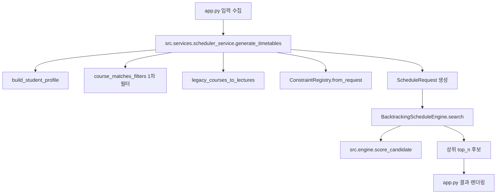

# 데이터 흐름 (현재 구현 기준)

이 문서는 **검색**과 **시간표 생성**이 실제 코드에서 어떻게 흐르는지 정리합니다.

## 1. 생성 API 입력 요약 (`src.services.scheduler_service.generate_timetables`)

| 인자 | 타입 | 설명 |
| :--- | :--- | :--- |
| `catalog` | `dict` | `data_loader`가 만든 강의/커리큘럼 데이터 |
| `grade`, `semester` | `str` | 학생 프로필 입력 (`"전체"` 포함) |
| `include_regex`, `exclude_regex` | `str` | 전체 검색 텍스트 포함/제외 정규식 |
| `preferred_ids` | `set[str]` | 장바구니(필수) 강의 ID |
| `candidate_ids` | `set[str]` | 위시(후보) 강의 ID |
| `excluded_ids` | `set[str]` | 제외 강의 ID |
| `alternative_groups` | `list[set[str]]` | 그룹바구니(그룹별 최소 1개 충족 + 중복 선택 방지) |
| `min_credits`, `max_credits` | `int` | 학점 범위 |
| `elective_count` | `int` | 레거시 호환 인자(현재 서비스 엔진에서 직접 사용하지 않음) |
| `top_n` | `int` | 반환 후보 수 |
| `weights` | `dict` | 선호 점수 가중치 |
| `filter_state` | `dict` | 타겟 학년/학과/시간/요일 등 상세 필터 |

## 2. 검색 탭 흐름 (`app.py` → `src/presentation/ui_state.py`)

1. 업로드된 강의 목록에 대해 `src.presentation.ui_state.matches_filters(...)` 호출
2. 내부에서 `src.filters.course_matches_filters(...)`로 조건 필터링
3. 통과 강의에 `src.filters.search_score(...)` 계산
4. 점수 내림차순으로 정렬해 UI 카드/표 렌더링

> 검색 규칙의 소유권은 `src.filters`에 있고, UI 상태/버킷 조작은 `src.presentation.ui_state`가 담당합니다.

## 3. 생성 흐름 (`app.py` → `src/services/scheduler_service.py`)

핵심 동작:

1. 서비스 계층(`scheduler_service`)에서 `filter_state`를 정규화하고 `StudentProfile`을 만듭니다.
2. `preferred_ids`와 유효한 그룹 강의는 강제 포함 후보로 간주해 필터에서 보호합니다.
3. 필터 통과 강의를 도메인 `Lecture`로 변환하고 `LectureCatalog`에 적재합니다.
4. `ConstraintRegistry`가 생성 hard 제약을 구성합니다.
5. 백트래킹 엔진이 가능한 조합을 탐색하고 top-N만 유지합니다.
6. `src.engine.score_candidate`가 기존 dict 기반 점수/정렬 키와 엔진 지표를 한 곳에서 계산합니다.
7. 최종 후보와 `warnings`/통계를 `info`로 반환합니다.

## 4. 출력 데이터

- 후보 리스트: `courses`, `score`, `sort_key`, `total_credits`, `rank` 포함
- 부가 정보(`info`):
  - 필터링 후 강의 수, 후보 수, 장바구니/제외/그룹 카운트
  - 필수 과목 분반 불가, 그룹 무효화 등 사용자 경고 메시지
